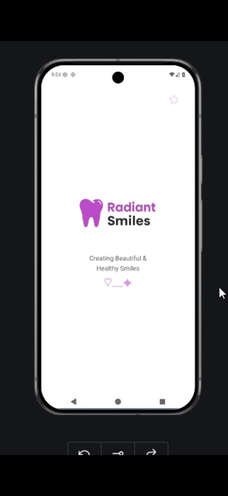
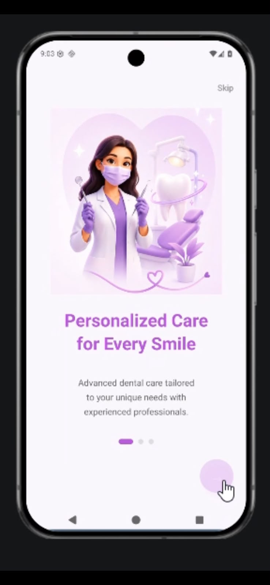
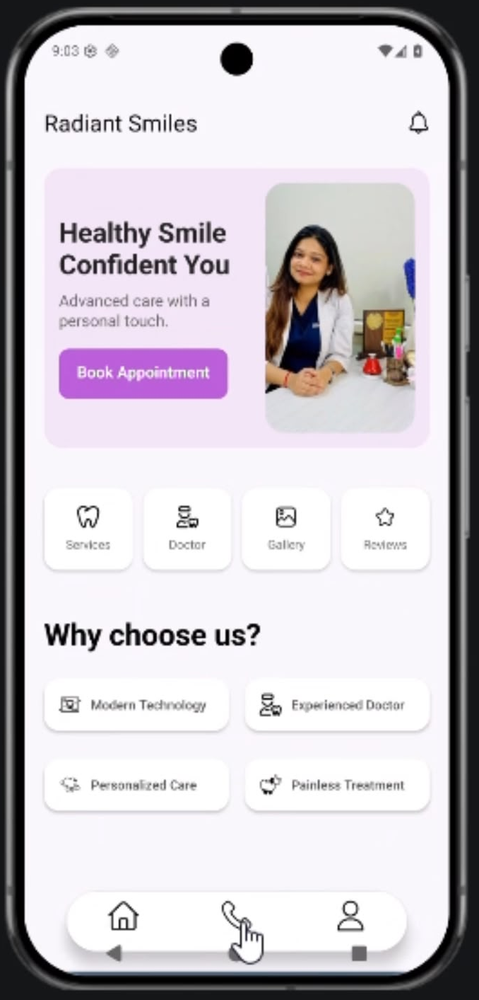
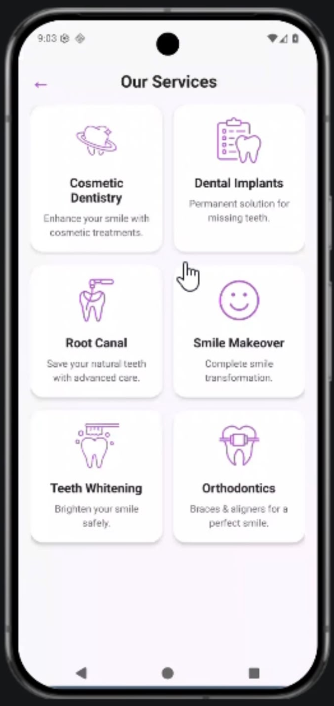
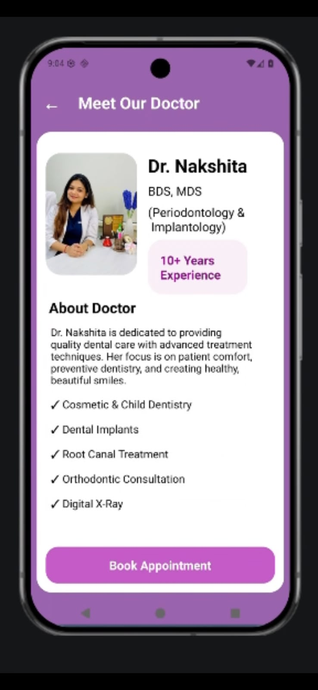
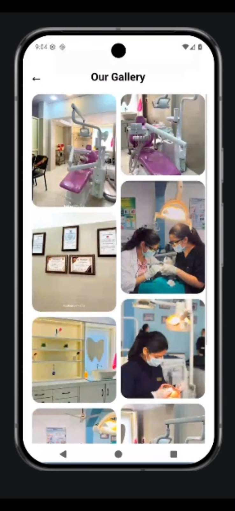
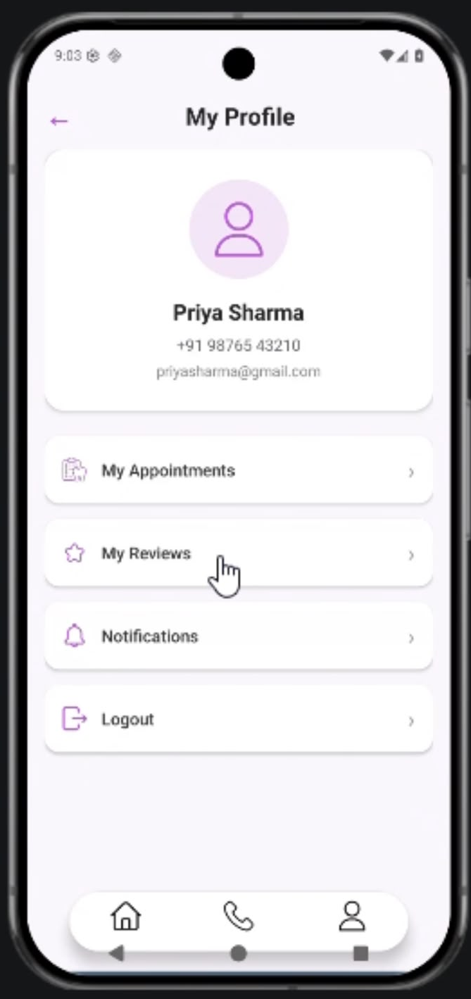

# 🦷 Radiant Smiles - Dental Clinic Mobile App

<p align="center">
  
</p>

<p align="center">
A full-stack React Native mobile application for booking dental appointments, managing patient profiles, and exploring dental services.
</p>

---

## 📌 Overview

Radiant Smiles is a modern dental clinic mobile application developed using React Native CLI. The app enables patients to browse services, book appointments, read reviews, view the clinic gallery, and manage their profiles through a clean and user-friendly interface.

This project also includes a Node.js + Express backend with MongoDB and Firebase Authentication.

---

# ✨ Features

- 🔐 Firebase Authentication
- 👤 User Registration & Login
- 🦷 Dental Services
- 👨‍⚕️ Doctor Information
- 📅 Book Appointment
- 📖 Appointment History
- ⭐ Patient Reviews
- 🖼️ Clinic Gallery
- 👤 User Profile
- 📱 Responsive Mobile UI
- 🔥 REST APIs
- ☁️ MongoDB Database

---

# 🛠 Tech Stack

## Frontend

- React Native CLI
- JavaScript
- React Navigation
- Axios
- Context API

## Backend

- Node.js
- Express.js
- MongoDB
- Mongoose

## Authentication

- Firebase Authentication

---

# 📂 Project Structure

```text
RadiantSmiles/
│
├── backend/
│   ├── src/
│   ├── server.js
│   ├── package.json
│   └── ...
│
├── frontend/
│   ├── assets/
│   ├── navigation/
│   ├── screens/
│   ├── services/
│   └── ...
│
├── screenshots/
│
├── App.js
├── package.json
└── README.md
```

---

# 📱 App Screenshots

<p align="center">
  
  
  
</p>

<p align="center">
  
  
  
</p>

<p align="center">
  
</p>

# ⚙️ Installation

## Clone Repository

```bash
git clone https://github.com/YOUR_USERNAME/RadiantSmiles.git
```

---

## Install Frontend Dependencies

```bash
npm install
```

---

## Install Backend Dependencies

```bash
cd backend
npm install
```
---

## Start Backend

```bash
cd backend

npm start
```

or

```bash
npm run dev
```

---

## Start React Native

```bash
npx react-native start
```

---

## Run Android App

```bash
npx react-native run-android
```

---

# 📚 API Modules

- Authentication
- Appointments
- Reviews
- User Profile

---

# 🚀 Future Improvements

- Online Payment Integration
- Push Notifications
- Admin Dashboard
- Appointment Reminders
- Doctor Availability Calendar
- Medical Records
- Dark Mode

---

# 👩‍💻 Author

**Babita**

Portfolio:
https://portfoliobabita.vercel.app/


