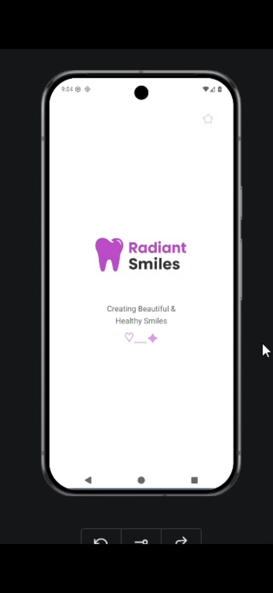
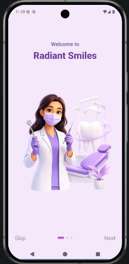
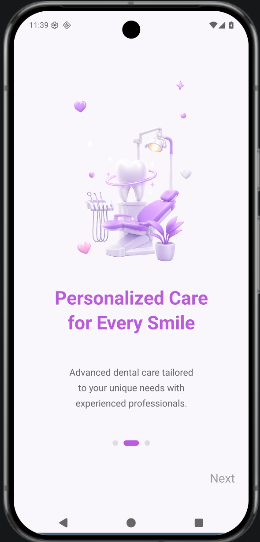
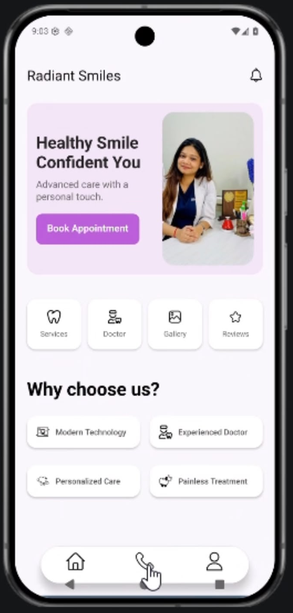
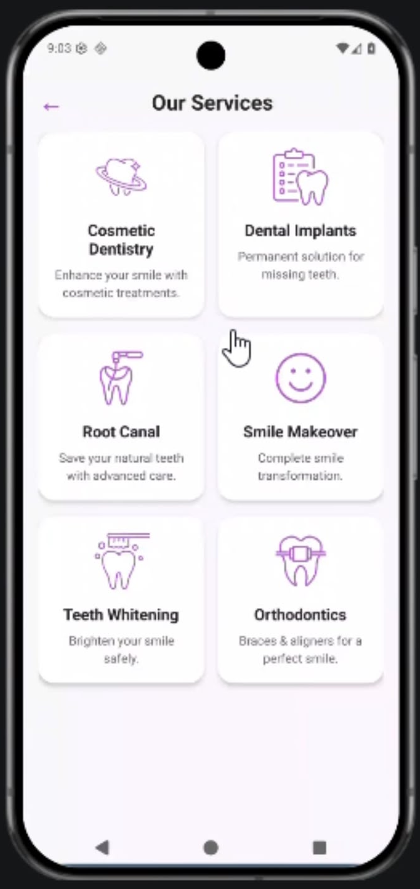
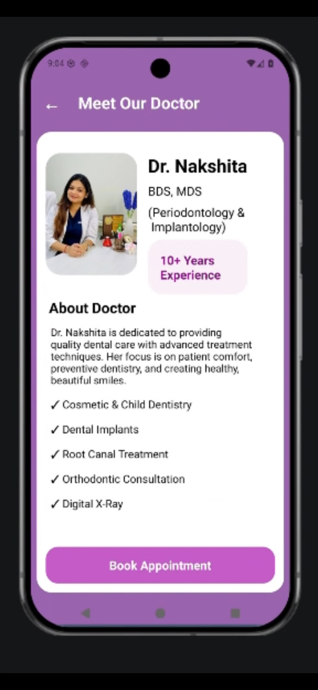
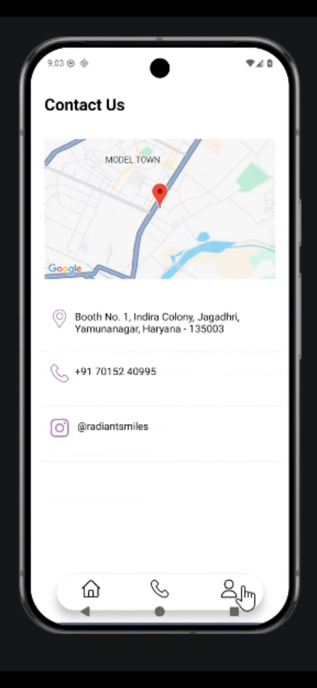
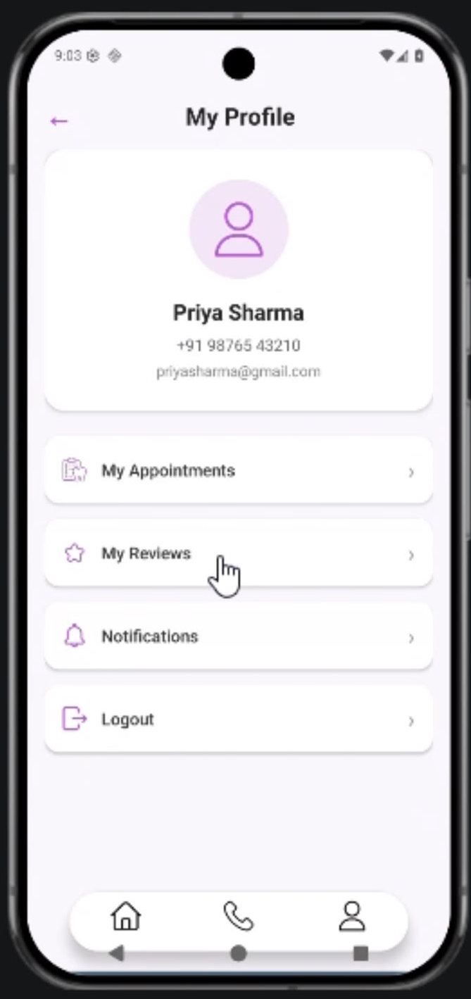
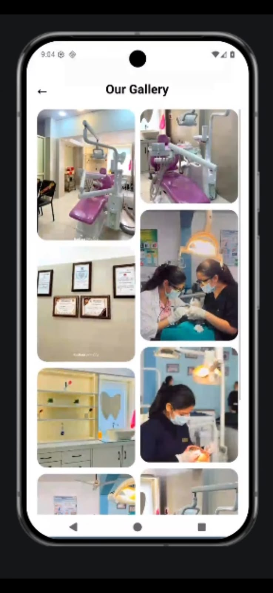

# 🦷 RadiantSmiles

A full-stack Dental Clinic Management Mobile Application built using **React Native CLI**, **Node.js**, **Express.js**, **MongoDB**, **Firebase Authentication**, and **Google Gemini AI**.

RadiantSmiles helps patients book appointments, explore dental services, chat with an AI assistant, manage their profile, and interact with a modern dental clinic digitally.

---

# ✨ Features

- 🔐 Firebase Authentication
- 👩‍⚕️ Doctor Profile
- 📅 Appointment Booking
- 🤖 Gemini AI Dental Chatbot
- 🏥 Dental Services
- 🖼️ Clinic Gallery
- ⭐ Patient Reviews
- 📍 Contact & Clinic Location
- 👤 User Profile
- 🎨 Modern UI
- 📱 React Native CLI
- 🌐 REST API Backend

---

# 🛠 Tech Stack

## Frontend

- React Native CLI
- React Navigation
- Firebase Authentication
- Axios
- React Native Maps
- React Native Vector Icons

## Backend

- Node.js
- Express.js
- MongoDB
- Mongoose
- Gemini AI API

## Database

- MongoDB Atlas
---

# 📱 Application Screens

<table>
<tr>
<td align="center">
 
<b>Splash</b>
</td>

<td align="center">
 
<b>Onboarding</b>
</td>

<td align="center">
 
<b>Onboarding</b>
</td>
</tr>

<tr>
<td align="center">
 
<b>Home</b>
</td>
  
<td align="center">
 
<b>Services</b>
</td>

<td align="center">
 
<b>Doctor</b>
</td>
</tr>

<tr>
<td align="center">
 
<b>Contact</b>
</td>

<td align="center">
 
<b>Profile</b>
</td>

<td align="center">
 
<b>Gallery</b>
</td>

<td></td>
</tr>
</table>

# 🤖 AI Chatbot

RadiantSmiles includes an AI-powered chatbot using **Google Gemini AI**.

Features:

- Dental care guidance
- Oral hygiene tips
- Frequently asked questions
- General treatment information

---

# 👩‍💻 Developer

**Babita**

GitHub

https://github.com/Babita153

---

# 📄 License

This project is developed for educational and learning purposes.
